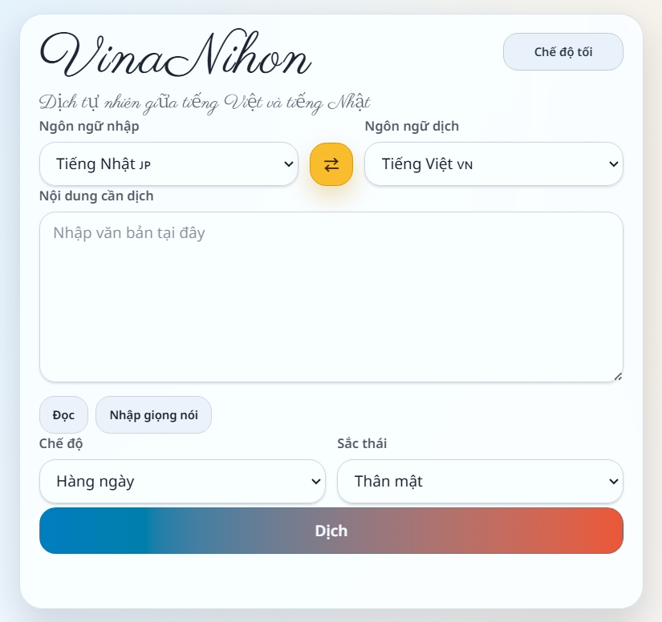
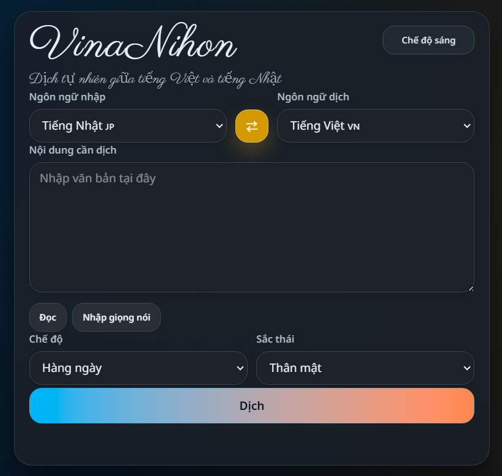

# VinaNihon（ゔぃなにほん）🇯🇵🇻🇳

[日本語](README.md)

Đây là một MVP dịch thuật đơn giản, tập trung vào tiếng Việt 🇻🇳 ↔ tiếng Nhật 🇯🇵.  
Bạn có thể dịch trực tiếp ngay trên trang chủ, đồng thời xem các cách diễn đạt khác, sắc thái ý nghĩa và ví dụ trả lời.

Trong ô nhập liệu, các nút nhập giọng nói và đọc văn bản được nhúng ngay ở góc phải phía dưới của textarea, hiển thị bằng icon kèm tooltip.
Mỗi phần trong kết quả dịch cũng dùng nút icon + tooltip cho thao tác đọc và sao chép.
Lịch sử dịch được lưu trong `localStorage` của trình duyệt với tối đa 20 mục gần nhất.
Khung lịch sử dùng accordion với header sticky, cho phép mở từng mục rồi dùng lại, sao chép, xóa hoặc đọc bản dịch chính.
Ngôn ngữ giao diện có thể chuyển bằng nút chuyển đổi ở góc trên bên phải của khung chính (日本語｜ベトナム語), và được lưu trong SESSION KV theo phiên người dùng.

 

## Stack

- Astro + TypeScript
- Cloudflare Pages (`@astrojs/cloudflare`)
- Astro API routes (`/api/translate`, `/api/reply`)
- Provider abstraction (`mock` / `openai`)

## Thiết lập cục bộ (Astro dev)

1. Cài dependencies:

```bash
npm install
```

2. Tạo file env cục bộ:

```bash
cp .env.example .env
```

3. (Tùy chọn) bật provider thật trong `.env`:

```dotenv
TRANSLATION_PROVIDER=openai
OPENAI_API_KEY=your_api_key
# Optional
OPENAI_MODEL=gpt-4.1-mini
OPENAI_BASE_URL=https://api.openai.com/v1
```

Nếu muốn dùng API tương thích OpenAI nhưng vẫn giữ `openai` provider:

```dotenv
TRANSLATION_PROVIDER=openai
OPENAI_API_KEY=your_compatible_api_key
OPENAI_MODEL=MiniMax-M2.5
OPENAI_BASE_URL=https://api.minimax.io/v1
```

4. Chạy:

```bash
npm run dev
```

5. Mở: `http://localhost:4321`

## Xem trước cục bộ (bản build)

`npm run dev` là server dùng khi đang phát triển. Nếu muốn xem đúng output sau khi build, hãy chạy `build` trước rồi dùng `preview`.

1. Build:

```bash
npm run build
```

2. Chạy preview cho bản đã build:

```bash
npm run preview
```

3. Mở: `http://localhost:4321`

Nếu PowerShell gặp lỗi với wrapper `npm`, hãy dùng `npm.cmd` như sau.

```powershell
npm.cmd run build
npm.cmd run preview
```

## Bắt đầu nhanh

Nếu cấu hình `.env` như dưới đây, ứng dụng sẽ dùng bản dịch OpenAI thật:

```dotenv
TRANSLATION_PROVIDER=openai
OPENAI_API_KEY=your_api_key
OPENAI_MODEL=gpt-4.1-mini
OPENAI_BASE_URL=https://api.openai.com/v1
```

Sau đó chạy `npm run dev` và thực hiện dịch ngay từ trang chủ.

Nếu đổi `TRANSLATION_PROVIDER` về `mock`, ứng dụng sẽ quay lại chế độ mock ngay lập tức.

Nếu muốn dùng MiniMax với `openai` provider, dùng cấu hình sau:

```dotenv
TRANSLATION_PROVIDER=openai
OPENAI_API_KEY=your_minimax_api_key
OPENAI_MODEL=MiniMax-M2.7
OPENAI_BASE_URL=https://api.minimax.io/v1
```

## Lịch sử

- Lịch sử được lưu trong `localStorage` của từng trình duyệt
- Dữ liệu lưu gồm văn bản gốc, bản dịch chính, hướng dịch, chế độ, sắc thái và thời gian tạo
- Giữ tối đa 20 mục mới nhất; mỗi mục hiển thị như một accordion có phần thời gian riêng
- Header lịch sử và nút xóa toàn bộ luôn còn hiển thị khi cuộn
- Từng mục hỗ trợ dùng lại, sao chép bản dịch chính, đọc bản dịch chính và xóa riêng
- Các dòng lịch sử được tô xen kẽ để dễ phân biệt hơn khi xem nhanh
- Thông tin bổ sung như cách diễn đạt khác, ghi chú sắc thái và gợi ý phản hồi không được lưu trong lịch sử; nếu cần sẽ tải lại sau

## Ngôn ngữ giao diện

- Có thể chuyển ngôn ngữ giao diện bằng nút chuyển đổi ở góc trên bên phải của khung chính (日本語｜ベトナム語)
- Ngôn ngữ giao diện được lưu trong SESSION KV của Cloudflare theo phiên người dùng
- Ngôn ngữ nguồn dịch (sourceLang) vẫn được lưu trong `localStorage` như trước

## Biến môi trường

Trong môi trường phát triển Astro cục bộ, dùng `.env`.

- `TRANSLATION_PROVIDER=mock` (mặc định)
- `OPENAI_API_KEY=` (bắt buộc khi `TRANSLATION_PROVIDER=openai`)
- `OPENAI_MODEL=gpt-4.1-mini` (tùy chọn)
- `OPENAI_BASE_URL=https://api.openai.com/v1` (tùy chọn)

Ví dụ khi dùng MiniMax:

- `TRANSLATION_PROVIDER=openai`
- `OPENAI_API_KEY=your_minimax_api_key`
- `OPENAI_MODEL=MiniMax-M2.7`
- `OPENAI_BASE_URL=https://api.minimax.io/v1`

Đối với runtime trên Cloudflare Pages, hãy đặt cùng các biến đó trong phần cài đặt của dự án Pages.

Nếu dùng runtime cục bộ của Wrangler, `.dev.vars` cũng được hỗ trợ.

## Thiết lập Cloudflare Pages

Dự án này được cấu hình cho Cloudflare Pages Functions.

### `wrangler.jsonc`

`wrangler.jsonc` hiện bao gồm:

- `pages_build_output_dir: "./dist"`
- `compatibility_flags: ["nodejs_compat"]`
- KV binding `SESSION` cho Astro sessions
- `env.preview` hiện dùng cùng KV namespace `SESSION` với production
- Không có trường `main`, vì repository này deploy lên Cloudflare Pages chứ không phải standalone Worker

Nếu sau này muốn tách biệt Preview và Production, bạn có thể thêm một Preview KV namespace riêng.

### 1. Tạo KV namespace `SESSION`

```bash
npx wrangler kv namespace create SESSION
```

Sao chép ID được trả về vào `wrangler.jsonc`:

```jsonc
"kv_namespaces": [
  {
    "binding": "SESSION",
    "id": "your-session-kv-id"
  }
]
```

Nếu sau này muốn có Preview KV riêng, hãy thêm namespace khác và override trong `env.preview`.

### 2. Cấu hình dự án Pages

Trong Cloudflare Pages:

- Kết nối repository GitHub này
- Build command: `npm run build`
- Build output directory: `dist`
- Phiên bản Node.js: `22`

### 3. Thêm biến môi trường

Trong phần cài đặt dự án Pages, thêm các biến runtime giống như trong `.env` cục bộ.

Ví dụ:

- `TRANSLATION_PROVIDER=mock`
- `TRANSLATION_PROVIDER=openai` cùng với `OPENAI_API_KEY`
- `TRANSLATION_PROVIDER=openai` cùng với `OPENAI_BASE_URL=https://api.minimax.io/v1`

### 4. Gắn KV namespace vào Pages

Trong phần cài đặt dự án Pages, thêm một KV binding:

- Tên biến: `SESSION`
- KV namespace: chính namespace đang dùng trong `wrangler.jsonc`

## Routes

### `POST /api/translate`

Request:

```json
{
  "sourceLang": "ja",
  "targetLang": "vi",
  "text": "こんにちは",
  "mode": "daily",
  "tone": "normal"
}
```

Response:

```json
{
  "mainTranslation": "...",
  "context": {
    "sourceLang": "ja",
    "targetLang": "vi",
    "mode": "daily",
    "tone": "normal"
  }
}
```

### `POST /api/translate-details`

Request:

```json
{
  "sourceLang": "ja",
  "targetLang": "vi",
  "originalText": "こんにちは",
  "mainTranslation": "Xin chào",
  "mode": "daily",
  "tone": "normal"
}
```

Response:

```json
{
  "alternatives": ["..."],
  "nuanceNotes": ["..."],
  "suggestedReplies": ["..."]
}
```

### `POST /api/reply`

Request:

```json
{
  "sourceLang": "ja",
  "targetLang": "vi",
  "originalText": "こんにちは",
  "mainTranslation": "Xin chào",
  "mode": "daily",
  "tone": "normal"
}
```

Response:

```json
{
  "suggestedReplies": ["..."]
}
```

## Kiến trúc provider

`src/lib/translate/` cung cấp lớp trừu tượng cho service:

- `mock` provider: fallback luôn sẵn sàng
- `openai` provider: gọi `POST https://api.openai.com/v1/responses`
  Nếu đổi `OPENAI_BASE_URL` sang một endpoint tương thích OpenAI, hệ thống sẽ tự chọn `responses` hoặc `chat/completions` tùy backend đó.

Contract của API routes không thay đổi. `/api/translate` và `/api/reply` vẫn chỉ đóng vai trò mỏng và ủy quyền cho service layer.

Trang chủ dùng một request `/api/translate`, nên bản dịch và các câu trả lời gợi ý được tạo trong một lần gọi provider. `/api/reply` vẫn được giữ lại như endpoint riêng để tương thích ngược.

Đối với Cloudflare Pages CI, script build sẽ xóa các file sinh ra như `_worker.js/wrangler.json`, `_worker.js/.dev.vars` và `.wrangler/deploy/config.json` sau khi `astro build`. Script cũng sao chép `_worker.js/entry.mjs` sang `_worker.js/index.js` vì trình upload Pages hiện tại yêu cầu tên file đó khi deploy.

## API Smoke Test (cục bộ)

Sau khi khởi động dev server, bạn có thể kiểm tra API bằng các lệnh sau.

```bash
curl -s -X POST http://localhost:4321/api/translate \
  -H "content-type: application/json" \
  -d '{
    "sourceLang":"ja",
    "targetLang":"vi",
    "text":"こんにちは",
    "mode":"daily",
    "tone":"normal"
  }'
```

```bash
curl -s -X POST http://localhost:4321/api/reply \
  -H "content-type: application/json" \
  -d '{
    "sourceLang":"ja",
    "targetLang":"vi",
    "originalText":"こんにちは",
    "mainTranslation":"Xin chào",
    "mode":"daily",
    "tone":"normal"
  }'
```

## Khắc phục sự cố

- Nút nhập giọng nói bị vô hiệu hóa
  - Cần có `SpeechRecognition` hoặc `webkitSpeechRecognition`. Thường có trên các trình duyệt họ Chrome. Khi không hỗ trợ, icon trong textarea vẫn hiện ở dạng mờ như placeholder.
- Giọng đọc không đúng như mong muốn
  - Các giọng đọc khả dụng phụ thuộc vào trình duyệt và hệ điều hành. Tiếng Nhật ưu tiên `ja-JP`, tiếng Việt ưu tiên `vi-VN`.
- `OPENAI_API_KEY is required when TRANSLATION_PROVIDER=openai.`
  - Hãy kiểm tra xem `.env` đã có `OPENAI_API_KEY` hay chưa.
- Muốn dùng MiniMax bằng `openai` provider
  - Hãy đặt `OPENAI_BASE_URL=https://api.minimax.io/v1` và `OPENAI_MODEL=MiniMax-M2.7`.
- Lịch sử khác nhau giữa các trình duyệt
  - Lịch sử hiện được lưu bằng `localStorage`, nên không tự đồng bộ giữa các trình duyệt hoặc cửa sổ ẩn danh.
- Xuất hiện lỗi phía OpenAI liên quan đến `json_object`
  - Phần triển khai đã có bổ sung chỉ dẫn `json` trong input. Hãy dừng tiến trình dev server cũ và khởi động lại.
- `npm run check` báo lỗi thiếu `@rollup/rollup-linux-x64-gnu`
  - Đây là vấn đề optional dependency của npm. Hãy chạy lại `npm i`.

## Scripts

- `npm run dev`: khởi động Astro dev server
- `npm run build`: tạo output cho Cloudflare Pages trong `dist/`
- `npm run preview`: xem cục bộ output sau khi `build`
- `npm run check`: chạy kiểm tra Astro / TypeScript

## License

This project is licensed under the MIT License. See the [LICENSE](./LICENSE) file for details.
