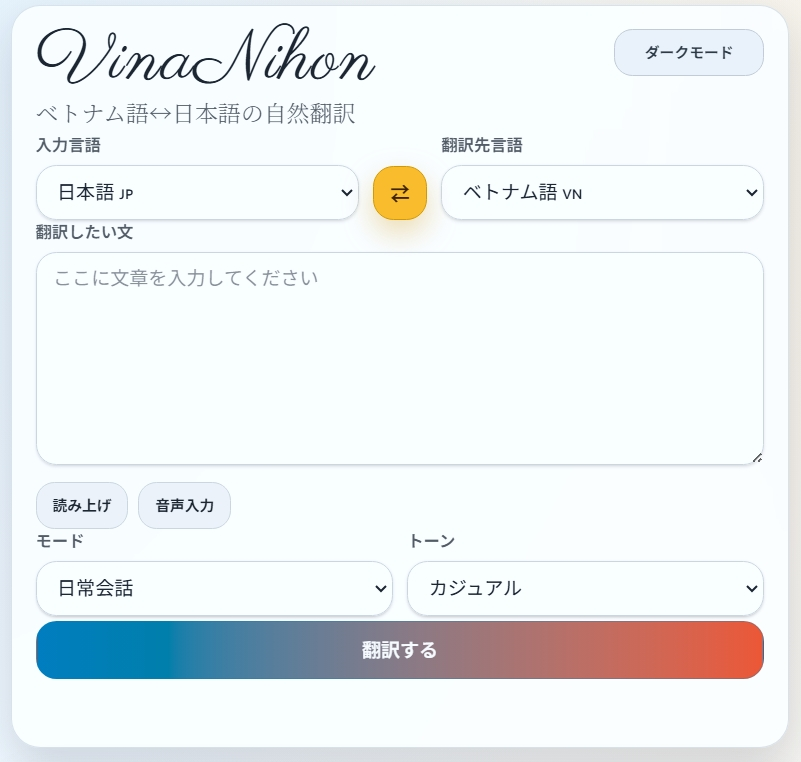
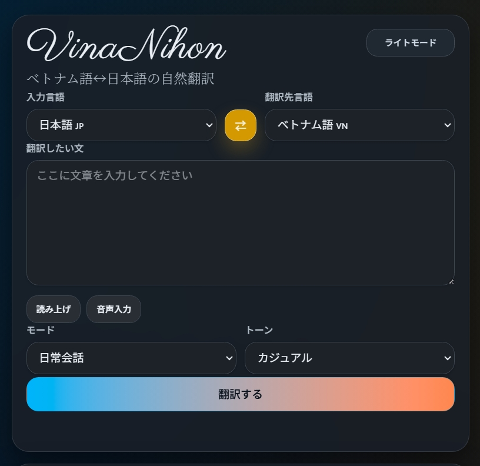

# VinaNihon（ゔぃなにほん）🇯🇵🇻🇳

[Tiếng Việt](README-vi.md)

ベトナム語🇻🇳↔日本語🇯🇵に特化した、シンプルな翻訳MVPです。  
トップページでそのまま翻訳でき、言い換え・ニュアンス・返信例まで確認できます。

入力欄では textarea 右下に音声入力・読み上げボタンを埋め込み、アイコンとツールチップで操作できます。
翻訳結果の各セクションも、読み上げ・コピーをアイコンボタン + ツールチップで利用できます。
翻訳履歴はブラウザの `localStorage` に最新 100 件まで保存されます。
履歴ペインはメインペインと高さを揃えた sticky ヘッダー付きの accordion で、各項目のピン留め・再入力・コピー・削除・読み上げを行えます。
UI言語はメインペイン右上のトグルボタン（日本語｜ベトナム語）で切り替えられ、Cookie単位で SESSION KV に保存されます。

 

## Stack

- Astro + TypeScript
- Cloudflare Pages (`@astrojs/cloudflare`)
- Astro API routes (`/api/translate`, `/api/reply`)
- Provider abstraction (`mock` / `openai`)

## Local Setup (Astro dev)

1. Install dependencies:

```bash
npm install
```

2. Create local env file:

```bash
cp .env.example .env
```

3. (Optional) enable a real provider in `.env`:

```dotenv
TRANSLATION_PROVIDER=openai
OPENAI_API_KEY=your_api_key
# Optional
OPENAI_MODEL=gpt-4.1-mini
OPENAI_BASE_URL=https://api.openai.com/v1
```

OpenAI-compatible API を `openai` provider のまま使う場合:

```dotenv
TRANSLATION_PROVIDER=openai
OPENAI_API_KEY=your_compatible_api_key
OPENAI_MODEL=MiniMax-M2.5
OPENAI_BASE_URL=https://api.minimax.io/v1
```

4. Run:

```bash
npm run dev
```

5. Open: `http://localhost:4321`

## Local Preview (built output)

`npm run dev` は開発用サーバーです。ビルド後の出力を確認したいときは、先に `build` してから `preview` を使います。

1. Build:

```bash
npm run build
```

2. Preview the built app:

```bash
npm run preview
```

3. Open: `http://localhost:4321`

PowerShell 環境で `npm` ラッパーがうまく動かない場合は、次のように `npm.cmd` を使ってください。

```powershell
npm.cmd run build
npm.cmd run preview
```

## Quick Start

`.env` を以下のように設定すると、実際の OpenAI 翻訳を使えます。

```dotenv
TRANSLATION_PROVIDER=openai
OPENAI_API_KEY=your_api_key
OPENAI_MODEL=gpt-4.1-mini
OPENAI_BASE_URL=https://api.openai.com/v1
```

その後 `npm run dev` を起動し、トップページから翻訳を実行してください。

`TRANSLATION_PROVIDER` を `mock` に戻すと、即座にモック動作へ切り替わります。

MiniMax を `openai` provider のまま使う場合は次の設定です。

```dotenv
TRANSLATION_PROVIDER=openai
OPENAI_API_KEY=your_minimax_api_key
OPENAI_MODEL=MiniMax-M2.7
OPENAI_BASE_URL=https://api.minimax.io/v1
```

## History

- 履歴は各ブラウザの `localStorage` に保存されます
- 保存対象は原文、主翻訳、言語方向、モード、トーン、作成日時です
- 最新 100 件まで保持し、ピン留めした履歴は先頭のセクションに分けて表示されます
- 履歴ヘッダーと全件削除ボタンはスクロール中も表示されたままです
- 各履歴からピン留め / ピン留め解除、再入力、主翻訳のコピー、主翻訳の読み上げ、個別削除ができます
- 履歴行は視認性向上のために交互に色分けされています
- 補足情報（言い換え候補、ニュアンスメモ、返信例）は履歴には保存されず、再表示時に必要なら再取得します

## UI言語

- メインペイン右上のトグルボタン（日本語｜ベトナム語）でUI言語を切り替えられます
- UI言語の設定は Cloudflare SESSION KV に保存され、ユーザーのセッション単位で保持されます
- 翻訳元言語（sourceLang）は従来通り `localStorage` に保存されます

## 環境変数

Astro のローカル開発では `.env` を使用します。

- `TRANSLATION_PROVIDER=mock` (デフォルト)
- `OPENAI_API_KEY=` (`TRANSLATION_PROVIDER=openai` の場合必須)
- `OPENAI_MODEL=gpt-4.1-mini` (任意)
- `OPENAI_BASE_URL=https://api.openai.com/v1` (任意)

MiniMax を使う場合の例:

- `TRANSLATION_PROVIDER=openai`
- `OPENAI_API_KEY=your_minimax_api_key`
- `OPENAI_MODEL=MiniMax-M2.7`
- `OPENAI_BASE_URL=https://api.minimax.io/v1`

Cloudflare Pages ランタイムでは、Pages プロジェクト設定で同じ環境変数を設定してください。

Wrangler ローカルランタイムを使用する場合は、`.dev.vars` もサポートされています。

## Cloudflare Pages 設定

このプロジェクトは Cloudflare Pages Functions 用に設定されています。

### `wrangler.jsonc`

`wrangler.jsonc` の内容包括:

- `pages_build_output_dir: "./dist"`
- `compatibility_flags: ["nodejs_compat"]`
- Astro sessions 用 `SESSION` KV binding
- `env.preview` はデフォルトで production と同じ `SESSION` KV namespace を使用
- `main` フィールドなし（このリポジトリは Standalone Worker ではなく Cloudflare Pages にデプロイするため）

Preview と Production を分離する必要がある場合は、後で別の Preview KV namespace を追加してください。

### 1. `SESSION` KV namespace を作成

```bash
npx wrangler kv namespace create SESSION
```

返された ID を `wrangler.jsonc` にコピーします:

```jsonc
"kv_namespaces": [
  {
    "binding": "SESSION",
    "id": "your-session-kv-id"
  }
]
```

後で Preview KV を分離する場合は、別の namespace を追加して `env.preview` で上書きしてください。

### 2. Pages プロジェクトを設定

Cloudflare Pages で:

- この GitHub リポジトリを接続
- Build command: `npm run build`
- Build output directory: `dist`
- Node.js version: `22`

### 3. 環境変数を追加

Pages プロジェクト設定で、ローカル環境の `.env` で使用するのと同じ環境変数を追加します。

例:

- `TRANSLATION_PROVIDER=mock`
- `TRANSLATION_PROVIDER=openai` + `OPENAI_API_KEY`
- `TRANSLATION_PROVIDER=openai` + `OPENAI_BASE_URL=https://api.minimax.io/v1`

### 4. Pages で KV namespace をバインド

Pages プロジェクト設定で KV binding を追加します:

- Variable name: `SESSION`
- KV namespace: `wrangler.jsonc` で使用 중인 same namespace

## Routes

### `POST /api/translate`

Request:

```json
{
  "sourceLang": "ja",
  "targetLang": "vi",
  "text": "こんにちは",
  "mode": "daily",
  "tone": "normal"
}
```

Response:

```json
{
  "mainTranslation": "...",
  "context": {
    "sourceLang": "ja",
    "targetLang": "vi",
    "mode": "daily",
    "tone": "normal"
  }
}
```

### `POST /api/translate-details`

Request:

```json
{
  "sourceLang": "ja",
  "targetLang": "vi",
  "originalText": "こんにちは",
  "mainTranslation": "Xin chào",
  "mode": "daily",
  "tone": "normal"
}
```

Response:

```json
{
  "alternatives": ["..."],
  "nuanceNotes": ["..."],
  "suggestedReplies": ["..."]
}
```

### `POST /api/reply`

Request:

```json
{
  "sourceLang": "ja",
  "targetLang": "vi",
  "originalText": "こんにちは",
  "mainTranslation": "Xin chào",
  "mode": "daily",
  "tone": "normal"
}
```

Response:

```json
{
  "suggestedReplies": ["..."]
}
```

## Provider Architecture

`src/lib/translate/` はサービス抽象化を提供します:

- `mock` provider: 常時利用可能なフォールバック
- `openai` provider: `POST https://api.openai.com/v1/responses` を呼び出します
  `OPENAI_BASE_URL` を OpenAI-compatible endpoint に切り替えた場合は、その backend に応じて `responses` または `chat/completions` を自動選択

API route contracts は変更なし。`/api/translate` と `/api/reply` は薄く、service layer に委任します。

このページは翻訳と言葉の提示が1回の provider 呼び出しで生成されるため、単一の `/api/translate` request を使用します。`/api/reply` は下位互換性のために別の endpoint として残っています。

Cloudflare Pages CI 用に、build script は `astro build` の後に生成された `_worker.js/wrangler.json`、`_worker.js/.dev.vars`、`.wrangler/deploy/config.json` を削除します。また、現在の Pages uploader はデプロイ時にそのファイル名を期待するため、`_worker.js/entry.mjs` を `_worker.js/index.js` にコピーします。

## API Smoke Test (local)

開発サーバー起動後に、以下で API の疎通確認ができます。

```bash
curl -s -X POST http://localhost:4321/api/translate \
  -H "content-type: application/json" \
  -d '{
    "sourceLang":"ja",
    "targetLang":"vi",
    "text":"こんにちは",
    "mode":"daily",
    "tone":"normal"
  }'
```

```bash
curl -s -X POST http://localhost:4321/api/reply \
  -H "content-type: application/json" \
  -d '{
    "sourceLang":"ja",
    "targetLang":"vi",
    "originalText":"こんにちは",
    "mainTranslation":"Xin chào",
    "mode":"daily",
    "tone":"normal"
  }'
```

## Troubleshooting

- 音声入力ボタンが無効になっている
  - `SpeechRecognition` / `webkitSpeechRecognition` が必要です。主に Chrome 系ブラウザで利用できます。非対応時も textarea 内には薄いプレースホルダー風のアイコンが残ります。
- 読み上げが期待した声で再生されない
  - 利用できる音声はブラウザと OS に依存します。日本語は `ja-JP`、ベトナム語は `vi-VN` を優先して選択します。
- `OPENAI_API_KEY is required when TRANSLATION_PROVIDER=openai.`
  - `.env` に `OPENAI_API_KEY` が設定されているか確認してください。
- MiniMax を `openai` provider で使いたい
  - `OPENAI_BASE_URL=https://api.minimax.io/v1` と `OPENAI_MODEL=MiniMax-M2.7` を設定してください。
- 履歴がブラウザごとに違う
  - 履歴はサーバー保存ではなく `localStorage` 保存です。別ブラウザやシークレットウィンドウとは共有されません。
- OpenAI 側エラーで `json_object` 関連メッセージが出る
  - 実装側で `json` 指示を入力に含める対応済みです。古い dev サーバープロセスを停止して再起動してください。
- `npm run check` で `@rollup/rollup-linux-x64-gnu` 欠落エラー
  - npm の optional dependency 問題です。`npm i` を再実行してください。

## Scripts

- `npm run dev` : Astro の開発サーバーを起動
- `npm run build` : Cloudflare Pages 向けの成果物を `dist/` に生成
- `npm run preview` : `build` 後の成果物をローカルで確認
- `npm run check` : Astro / TypeScript のチェックを実行

## License

このプロジェクトは MIT License の下でライセンスされています。詳細については [LICENSE](./LICENSE) ファイルを参照してください。
