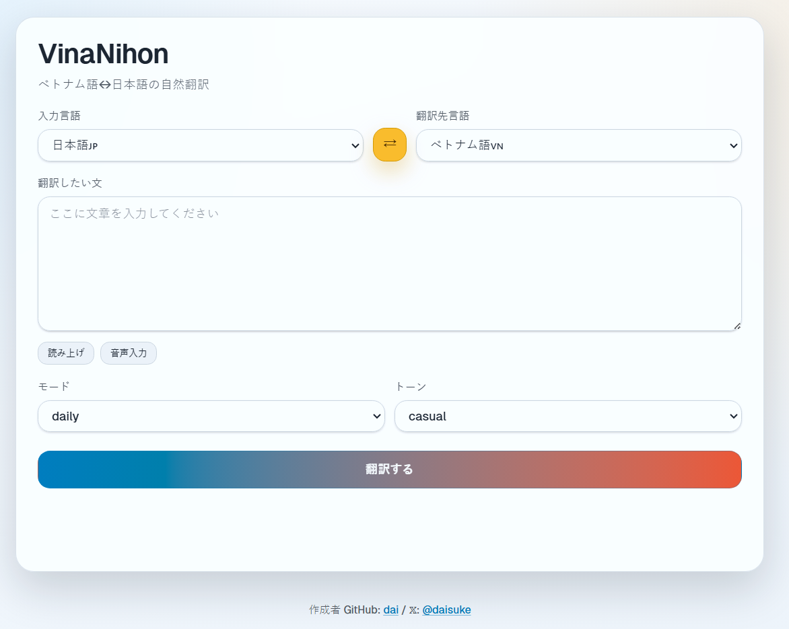

# VinaNihon（ゔぃなにほん）🇯🇵🇻🇳

ベトナム語🇻🇳↔日本語🇯🇵に特化した、シンプルな翻訳MVPです。  
トップページでそのまま翻訳でき、言い換え・ニュアンス・返信例まで確認できます。

入力欄で音声入力と読み上げ、翻訳結果の各セクションで読み上げを利用できます。



## Stack

- Astro + TypeScript
- Cloudflare Pages (`@astrojs/cloudflare`)
- Astro API routes (`/api/translate`, `/api/reply`)
- Provider abstraction (`mock` / `openai` / `claude`)

## Important: Claude vs GitHub Copilot

**Q: Does selecting Claude consume GitHub Copilot premium requests?**
**A: No.** Claude and GitHub Copilot are completely separate services:

- **Claude**: Anthropic's AI assistant, accessed via [Anthropic API](https://www.anthropic.com/api)
- **GitHub Copilot**: GitHub's code completion tool

Using Claude as a translation provider in this app will consume **Anthropic API credits**, not GitHub Copilot requests. They have separate billing systems.

## BYOK (Bring Your Own Key)

**Q: Can BYOK be configured?**
**A: Yes.** You can provide your own API key in two ways:

1. **Server-side configuration** (environment variables): Set `OPENAI_API_KEY` or `ANTHROPIC_API_KEY` in `.env` or Cloudflare Pages settings
2. **Runtime BYOK** (per-request): Include `provider` and `apiKey` fields in API requests to `/api/translate` or `/api/reply`

Example BYOK request:
```json
{
  "sourceLang": "ja",
  "targetLang": "vi",
  "text": "こんにちは",
  "mode": "daily",
  "tone": "normal",
  "provider": "claude",
  "apiKey": "sk-ant-..."
}
```

This allows users to use their own API keys without needing server-side configuration.

## Local Setup (Astro dev)

1. Install dependencies:

```bash
npm install
```

2. Create local env file:

```bash
cp .env.example .env
```

3. (Optional) enable a real provider in `.env`:

**OpenAI:**
```dotenv
TRANSLATION_PROVIDER=openai
OPENAI_API_KEY=your_api_key
# Optional
OPENAI_MODEL=gpt-4.1-mini
OPENAI_BASE_URL=https://api.openai.com/v1
```

**Claude:**
```dotenv
TRANSLATION_PROVIDER=claude
ANTHROPIC_API_KEY=your_anthropic_api_key
# Optional
CLAUDE_MODEL=claude-3-5-sonnet-20241022
```

OpenAI-compatible API を `openai` provider のまま使う場合:

```dotenv
TRANSLATION_PROVIDER=openai
OPENAI_API_KEY=your_compatible_api_key
OPENAI_MODEL=MiniMax-M1
OPENAI_BASE_URL=https://api.minimax.io/v1
```

4. Run:

```bash
npm run dev
```

5. Open: `http://localhost:4321`

## Quick Start

`.env` を以下のように設定すると、実際の OpenAI 翻訳を使えます。

**OpenAI:**
```dotenv
TRANSLATION_PROVIDER=openai
OPENAI_API_KEY=your_api_key
OPENAI_MODEL=gpt-4.1-mini
OPENAI_BASE_URL=https://api.openai.com/v1
```

**Claude:**
```dotenv
TRANSLATION_PROVIDER=claude
ANTHROPIC_API_KEY=your_anthropic_api_key
CLAUDE_MODEL=claude-3-5-sonnet-20241022
```

その後 `npm run dev` を起動し、トップページから翻訳を実行してください。

`TRANSLATION_PROVIDER` を `mock` に戻すと、即座にモック動作へ切り替わります。

MiniMax を `openai` provider のまま使う場合は次の設定です。

```dotenv
TRANSLATION_PROVIDER=openai
OPENAI_API_KEY=your_minimax_api_key
OPENAI_MODEL=MiniMax-M1
OPENAI_BASE_URL=https://api.minimax.io/v1
```

## Environment Variables

For Astro local development, use `.env`.

- `TRANSLATION_PROVIDER=mock` (default) - Options: `mock`, `openai`, `claude`
- `OPENAI_API_KEY=` (required when `TRANSLATION_PROVIDER=openai`)
- `OPENAI_MODEL=gpt-4.1-mini` (optional)
- `OPENAI_BASE_URL=https://api.openai.com/v1` (optional)
- `ANTHROPIC_API_KEY=` (required when `TRANSLATION_PROVIDER=claude`)
- `CLAUDE_MODEL=claude-3-5-sonnet-20241022` (optional)

For Cloudflare Pages runtime, set the same variables in Pages project settings.

If you use Wrangler local runtime, `.dev.vars` is also supported.

## Cloudflare Pages Setup

This project is configured for Cloudflare Pages Functions.

### `wrangler.jsonc`

`wrangler.jsonc` includes:

- `pages_build_output_dir: "./dist"`
- `compatibility_flags: ["nodejs_compat"]`
- `SESSION` KV binding for Astro sessions
- `env.preview` uses the same `SESSION` KV namespace as production by default
- No `main` field, because this repository deploys to Cloudflare Pages, not a standalone Worker

If you need Preview and Production to be isolated, add a separate Preview KV namespace later.

### 1. Create the `SESSION` KV namespace

```bash
npx wrangler kv namespace create SESSION
```

Copy the returned ID into `wrangler.jsonc`:

```jsonc
"kv_namespaces": [
  {
    "binding": "SESSION",
    "id": "your-session-kv-id"
  }
]
```

If you later want a separate Preview KV, add another namespace and override it under `env.preview`.

### 2. Configure the Pages project

In Cloudflare Pages:

- Connect this GitHub repository
- Build command: `npm run build`
- Build output directory: `dist`
- Node.js version: `22`

### 3. Add environment variables

In Pages project settings, add the same runtime variables you use locally in `.env`.

Examples:

- `TRANSLATION_PROVIDER=mock`
- `TRANSLATION_PROVIDER=openai` with `OPENAI_API_KEY`
- `TRANSLATION_PROVIDER=claude` with `ANTHROPIC_API_KEY`
- `TRANSLATION_PROVIDER=openai` with `OPENAI_BASE_URL=https://api.minimax.io/v1`

### 4. Bind the KV namespace in Pages

In Pages project settings, add a KV binding:

- Variable name: `SESSION`
- KV namespace: the same namespace used in `wrangler.jsonc`

## Routes

### `POST /api/translate`

Request:

```json
{
  "sourceLang": "ja",
  "targetLang": "vi",
  "text": "こんにちは",
  "mode": "daily",
  "tone": "normal"
}
```

Response:

```json
{
  "mainTranslation": "...",
  "alternatives": ["..."],
  "nuanceNotes": ["..."],
  "suggestedReplies": ["..."],
  "context": {
    "sourceLang": "ja",
    "targetLang": "vi",
    "mode": "daily",
    "tone": "normal"
  }
}
```

### `POST /api/reply`

Request:

```json
{
  "sourceLang": "ja",
  "targetLang": "vi",
  "originalText": "こんにちは",
  "mainTranslation": "...",
  "mode": "daily",
  "tone": "normal"
}
```

Response:

```json
{
  "suggestedReplies": ["..."]
}
```

## Provider Architecture

`src/lib/translate.ts` provides a service abstraction:

- `mock` provider: always available fallback
- `openai` provider: calls `POST https://api.openai.com/v1/responses`
  `OPENAI_BASE_URL` を OpenAI-compatible endpoint に切り替えた場合は、その backend に応じて `responses` または `chat/completions` を自動選択
- `claude` provider: uses Anthropic API via `@anthropic-ai/sdk`

API route contracts are unchanged. `/api/translate` and `/api/reply` stay thin and delegate to the service layer.

The homepage uses a single `/api/translate` request so translation and suggested replies are generated in one provider call. `/api/reply` remains available as a separate endpoint for compatibility.

**BYOK (Bring Your Own Key):** Both API endpoints support optional `provider` and `apiKey` fields in the request body, allowing runtime provider selection and API key override without server-side configuration.

For Cloudflare Pages CI, the build script removes generated `_worker.js/wrangler.json`, `_worker.js/.dev.vars`, and `.wrangler/deploy/config.json` after `astro build`. It also copies `_worker.js/entry.mjs` to `_worker.js/index.js` because the current Pages uploader expects that filename during deployment.

## API Smoke Test (local)

開発サーバー起動後に、以下で API の疎通確認ができます。

```bash
curl -s -X POST http://localhost:4321/api/translate \
  -H "content-type: application/json" \
  -d '{
    "sourceLang":"ja",
    "targetLang":"vi",
    "text":"こんにちは",
    "mode":"daily",
    "tone":"normal"
  }'
```

```bash
curl -s -X POST http://localhost:4321/api/reply \
  -H "content-type: application/json" \
  -d '{
    "sourceLang":"ja",
    "targetLang":"vi",
    "originalText":"こんにちは",
    "mainTranslation":"Xin chào",
    "mode":"daily",
    "tone":"normal"
  }'
```

## Troubleshooting

- 音声入力ボタンが無効になっている
  - `SpeechRecognition` / `webkitSpeechRecognition` が必要です。主に Chrome 系ブラウザで利用できます。
- 読み上げが期待した声で再生されない
  - 利用できる音声はブラウザと OS に依存します。日本語は `ja-JP`、ベトナム語は `vi-VN` を優先して選択します。
- `OPENAI_API_KEY is required when TRANSLATION_PROVIDER=openai.`
  - `.env` に `OPENAI_API_KEY` が設定されているか確認してください。
- `ANTHROPIC_API_KEY is required when TRANSLATION_PROVIDER=claude.`
  - `.env` に `ANTHROPIC_API_KEY` が設定されているか確認してください。
- MiniMax を `openai` provider で使いたい
  - `OPENAI_BASE_URL=https://api.minimax.io/v1` と `OPENAI_MODEL=MiniMax-M1` を設定してください。
- OpenAI 側エラーで `json_object` 関連メッセージが出る
  - 実装側で `json` 指示を入力に含める対応済みです。古い dev サーバープロセスを停止して再起動してください。
- `npm run check` で `@rollup/rollup-linux-x64-gnu` 欠落エラー
  - npm の optional dependency 問題です。`npm i` を再実行してください。

## Scripts

- `npm run dev`
- `npm run build`
- `npm run preview`
- `npm run check`
